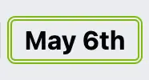

# WWSC Timesheets System

The timesheet system is intended for all staff at West Warwicks to record their working hours.

The system is directly linked into the company payroll and holiday tracking systems.

There are 2 main categories of staff at West Warwicks.

**Permanent** and **Zero Hours**

- Permanent staff are salary based and paid monthly.
- Zero hours staff are paid an hourly rate based on their age and role. Paydays are on a Monday every fortnight/14 days.

The system has the following simple processes.

1. **Login and Logout** - getting into the system and leaving the system.
2. **Clock in and Clock out** - clock in to start a shift, clock out to finish a shift
3. **History** - view the history of the shifts you have worked over different time period.
4. **Holidays** - show accrued leave, leave taken, holidays paid etc. _(displayed differently for permanent / zero-hours staff)_

## Login and Logout

All the tills and computers inside West Warwicks can be used to login. _(The login page is simply a website at https://timesheets.wwsc.cloud)_

You are prompted to enter the 4-digit passcode to get into the system. _(when you join WWSC your manager will allocate you a new passcode)_

Once you have entered the correct passcode you will be taken to the user screen.

> _(obviously it should have your own name!!. Please hit the logout button, top right, if it is not your name.)_

The "clock in" button is explained below.

To leave the system hit the "logout" button in top right of the screen.

> _(By the way if you save the webpage on your phone you can use your phone to login as long as you are in the building.)_

## Clock in and Clock out

Once you have gone through the login process above, to start your shift press the "clock in" button in the middle of the page.

You will then be presented with the clocked in screen.

The screen will show the time you started your shift and the duration _(how long you shift has been)_ will keep advancing while the page is open.

Typically at this point you should hit the logout button and start work.

At the end of your shift you should login again and you will see the same screen. However it will typically look more like this.

You will see the duration of your shift has advanced and you have a couple of options to tick and notes to fill in if you want to pass information onto your line manager.

> If you agreed with your manager/supervisor that you should work through your breaks then tick the no-breaks box. _(note it is not at all encouraged to work a long shift without breaks)_

> Similarly if you were asked by your manager to act as a supervisor for the shift then click the supervisor box.

> The notes field is to enter information that will be useful to your line manager.

> Please note _(your line manager still has to approve these before the any pay enhancement is given.)_

To end your shift hit the "clock out" button.

If you have successfully clocked out, the "clock out" button will disappear. You will then see your shift start time, shift end time and the duration in hours:minutes:seconds. There will also be "padlock" symbols against both lines which means the shift is over and you cannot change any of the inputs.

Typically at this point hit the "logout" button and head home!

## History

In order to help you understand the shifts you've worked recently you can have a look at your shift history.

Once you login, click on the history button and you will see the following.

This allows you to see the history of your shifts over different time periods.

- **today** - not very interesting but will show you the shifts you worked today. _(it is possible to work multiple shifts in the same day!)_
- **week** - show the shifts you have worked in the current Monday to Sunday week
- **last 7 days** - shifts worked in the last 7 days
- **fortnight** - more interesting for zero-hours staff as all the shifts in this period will be what is calculated into your next payslip.
- **last 14 days** - shifts worked in the last 14 days... typically more useful for supervisors / managers who can see everyone's shifts.
- **month** - shifts in the current calendar month. More interesting for permanent staff.
- **last 30 days** - again more interesting for management looking at all staff shifts
- **year** - all the shifts you worked this year. _(note in year 1 this is only shifts since the system replaced the paper system)_

Here's a example.

> _(If you see a 'grayed' out entry with a clock in the top right it is an active shift.)_

For each shift you will see the start date & time, end date & time, duration of the shift and whether you selected no-breaks, supervisor and notes when you clocked out.

## Holidays

Once you login, click on the "holidays" tab to view your holiday entitlement and history.

### Zero Hours

For zero hours staff you will see something like the following.

The first line contains the following information.

- **start** - the start date of the holiday period. Typically it will be the 1st of Jan in the current year but if you joined WWSC during the year it should be the date you joined.
- **brought forward** - if you worked in the previous calendar year this will be any holiday hours that your line manager agreed you could carry into the current holiday year.
- **accrued** - so this is a key figure. Every shift hour worked contributes to your holiday allowance. The calculation of your holiday allowance is _shift-hours - breaks \* .127_ This gets automatically added to your accrued hours after every shift.
- **paid** - whenever you take leave your line manager then decides how much of your accrued leave you can take. For example if you were to take 3 days leave _(as recorded on the rota)_ then you would be paid _3 x 8hrs = 24_ hours holiday pay. 24 hours is then deducted from your accrued leave.
- **total** - is simply _accrued + paid_ leave.
- **taken** - is the total number of hours recorded as leave on the rota. e.g. Number of days leave \* 8 hrs. _(Note: Not all taken leave is paid! If you have not accrued sufficient hours then typically your manager will only pay up to your current accrued hours)_
- **days** - simply _taken / 8_

The following lines show the days taken as holiday as indicated on the rota. Dates in bold with a double green border around them show dates in which holiday hours were paid and how many hours were entered.

### Permanent

- **start** - the start date of the holiday period. Typically it will be the 1st of Jan in the current year but if you joined WWSC during the year it should be the date you joined.
- **contract** - the number of days allowed according to your contract of employement. Typically in a full year this will be 20 days (not including bank holidays). If you join WWSC sometime during the year your _contract_ days allowance will be calculated pro-rated based on the number of days left in the calendar year. e.g. if you joined exactly halfway through the calendar year your contract allowance would be 10 days leave.
- **brought forward** - if you worked in the previous calendar year this will be any holiday days that your line manager agreed you could carry into the current holiday year.
- **accrued** - permanent staff can accrue additional days if the rota has them working bank holidays. Similarly also if your manager agrees to give you days-off-in-lieu then this can also add to your accrued leave. _(note the double green border on accrued days)_
- **taken** - this is the number of days leave agreed and approved by your line manager. Typically this is taken from the rota.
- **remaining** - the number of days leave left in this calendar year.

The following line(s) list out the days approved and taken as leave. The dates in bold text and double green border are the additional days accrued. _(either as bank-holidays worked or approved by your line manager)_

Days with a dashed line around them indicate half-days leave taken.

## Troubleshooting

- Forbidden - if you try to login to the system from outside West Warwicks you will simply get the word 'Forbidden' displayed on the screen.
